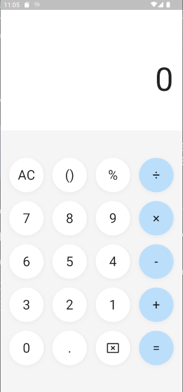

# Calox - A simple calculator app

Calox is a simple calculator app built with Flutter.



## Getting Started

You need to have these tools installed on your machine:

- Flutter SDK
- Either a physical phone or a phone emulator: Xcode (for MacOS users only) or Android Studio

Then run

```
flutter pub get
```

Connect to the physical phone/emulator

Finally, say `flutter run` to start the application.
